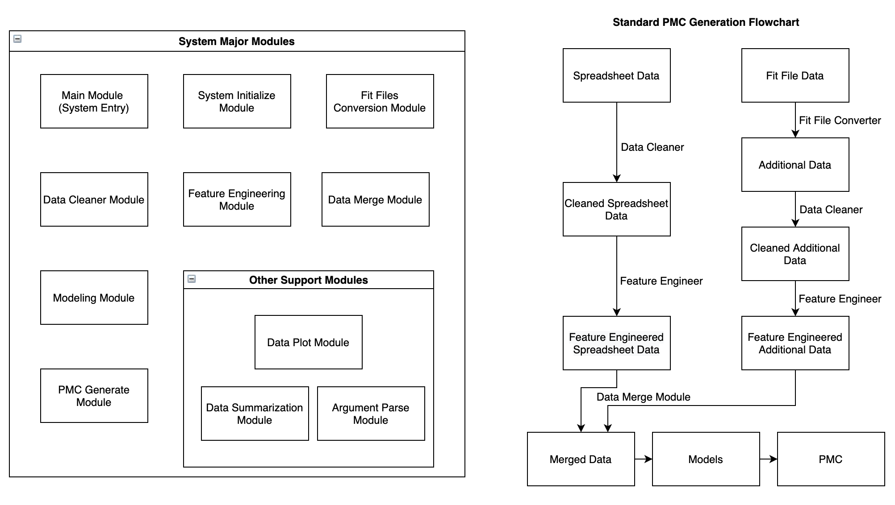
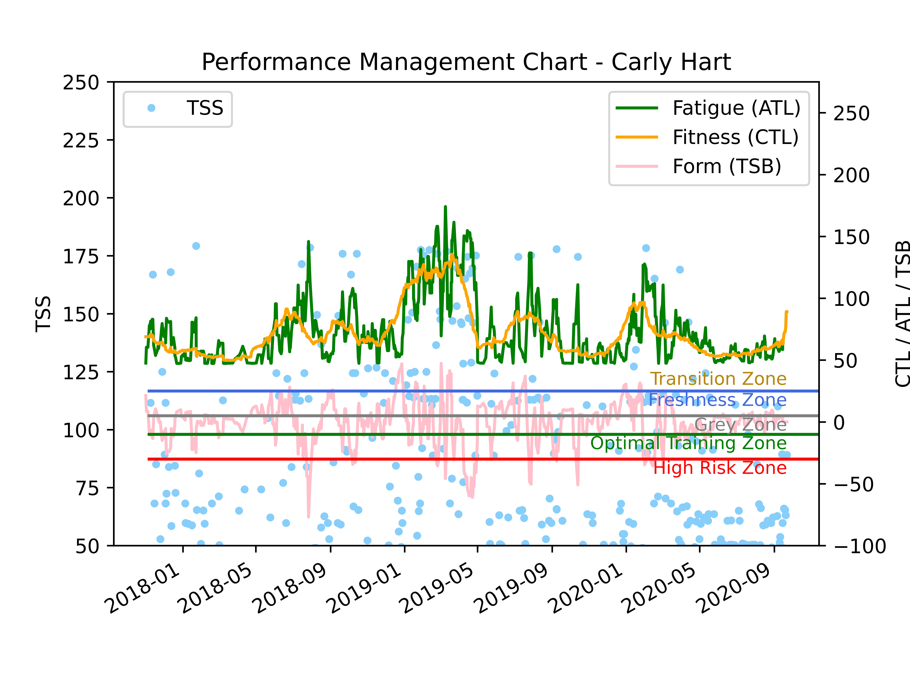
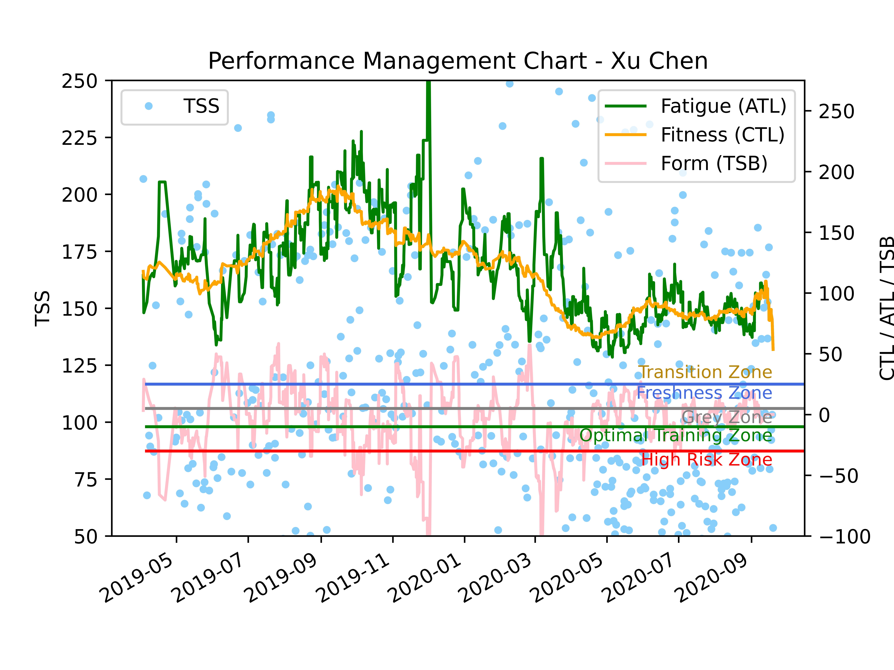

# Monitoring Athletes Performance
A CoachingMate analytical module to generate and deliver personalized feedback to coaches and athletes. Training sessions' descriptions could be 
merged with Garmin data to:
 - Assess if athletes are training as they should (Are the athletes training as suggested?).
 - Assess if athletes are training more or less than what they should (Are the athletes over-training or under-training?).
 - Predict/anticipate athlete risk fatigue levels (to avoid injuries).
 - Predict performance (We didn't focus on this task, but there's a place holder for future developers, 
 please see the `PerformanceModelBuilder` class in `data_modeling.py` module. Also cleaned data and extracted features are available if needed).


## Guidelines

### Prerequisites

#### Python Version
`Python 3.6` is preferred. Other Python versions should also work if there are no library conflicts between versions.

#### Environment Setup
1. Open the project `monitoring-athletes-performance` with IDE.
2. Use `the monitoring-athletes-performance/main` as the **content root**.
3. Setup the Python Interpreter. A virtual environment is suggested.
4. Run the following command to install the required packages.
    ```
    pip3 install -r requirements.txt
    ```
5. Put the spreadsheet data (eg. `Eduardo Oliveira.csv`) in the `data` directory.
6. Put the folder (eg. `fit_eduardo_oliveira`) contains `.fit` files in the `data` directory.

    **Optional:** What's more, our system supports you to simply convert `.fit` files in a separate module.
    Similarly, put the folder contains `.fit` files in the `data` directory, 
    for example athlete `fit_eduardo_oliveira`, `fit_xu_chen` and `fit_carly_hart`, 
    in your Terminal go to the `main` directory, and run the following commands. 
    Folders contains converted .csv files will show up in `data` directory.
    ```
    python3 fit_file_convert/process_all.py --subject-dir=../data --subject-name=csv_eduardo_oliveira --fit-source=../data/fit_eduardo_oliveira
    python3 fit_file_convert/process_all.py --subject-dir=../data --subject-name=csv_xu_chen --fit-source=../data/fit_xu_chen
    python3 fit_file_convert/process_all.py --subject-dir=../data --subject-name=csv_carly_hart --fit-source=../data/fit_carly_hart
    ```

### How to Run Our System

#### User's Option
Open the system built-in command-line tools or Terminal in a Python IDE, you can go to the main folder of the project,
and run the following command. 
```
python main.py --athletes-names xu_chen eduardo_oliveira --initialize-system=False --generate-pmc=True
```
The example above means you don't want to initialize the system (say it's your second time running this system),
but you do want to generate the Performance Management Charts for Xu Chen and Eduardo Oliveira (say you have updated the fit files).
Please refer to [Additional Help](#additional-help) for more options.

#### Developer's Option
For the developers who will work further based on this system, we recommend changing options in `main.py` for tests, and 
here's an overview.
```Python
if __name__ == '__main__':
    athletes_names = ['eduardo_oliveira', 'xu_chen', 'carly_hart']
    internal_args = ['--athletes-names={}'.format(' '.join(athletes_names)),
                     '--initialize-system=False', '--clean-data=False', '--process-feature-engineering=False',
                     '--build-model=False', '--generate-pmc=True']
    main(internal_args)
```

### System Sketch Map and Output Preview
<p align="center"> 
    
 </p>
 <p align="center"> 
    
    
 </p>
 

### System Structure
```
monitoring-athletes-performance
   ├── main
   │   ├── main.py
   |   ├── system_initialize.py
   │   ├── data_loader.py
   |   ├── data_cleaning.py
   |   ├── data_feature_engineering.py
   |   ├── data_merge.py
   |   ├── data_modeling.py
   |   ├── requirements.txt
   │   |── config
   │   |   ├── data_file_names.cfg
   │   |   ├── activity_types.cfg
   │   |   ├── column_data_types.cfg
   │   |   └── athlete_personal_info.json
   │   └── fit_file_convert
   │       ├── convert_fit_to_csv.py
   │       └── process_all.py
   ├── data
   │   ├── Eduardo Oliveira.csv
   │   ├── Xu Chen.csv
   │   ├── Carly Hart.csv
   |   ├── fit_eduardo_oliveira
   |   ├── fit_xu_chen
   |   ├── fit_carly_hart
   │   |── csv_eduardo_oliveira
   │   |   ├── fit_csv
   │   |   └── fit_files
   │   |── csv_xu_chen
   │   |   ├── fit_csv
   │   |   └── fit_files
   │   |── csv_carly_hart
   │   |   ├── fit_csv
   │   |   └── fit_files
   │   |── cleaned_spreadsheet
   │   |   ├── Carly Hart.csv
   │   |   ├── Eduardo Oliveira.csv
   │   |   └── Xu Chen.csv
   │   |── cleaned_additional
   │   |   ├── carly_hart
   │   |   ├── eduardo_oliveira
   │   |   └── xu_chen
   │   └── merged_dataframes
   |
   ├── log
   ├── models
   ├── plots
   |
   ├── LICENSE
   └── README.md
```


### Additional Help
```
optional arguments:
  -h, --help        show this help message and exit
  --initialize-system  INITIALIZE_SYSTEM
                    whether initialize the system, default is True  
  --clean-data  CLEAN_DATA
                    whether clean the data, default is True  
  --process-feature-engineering  FEATURE_ENGINEERING
                    whether do feature engineering, default is True  
  --build-model  BUILD_MODEL
                    whether process modeling, default is True  
  --generate-pmc  GENERATE_PMC
                    whether generate PMC, default is True  
  --display-tss-in-pmc  DISPLAY_TSS_IN_PMC
                    whether display TSS points in PMC, default is True  
  --athletes-names  ATHLETES_NAME
                    the athletes' names split by spaces, this is a require field
```

## Authors
* [**Lin Mi**](https://github.com/olivier0827) (983667) 
* [**Tingli Qiu**](https://github.com/qiutingli) (990497)
* [**Spoorthi Suresh Avvanna**](https://github.com/spoorthiavvanna) (1037470)
* [**Chitra Naga Durga Sindhusha Veluguleti**](https://github.com/sveluguleti) (1045391)
* [**Yuhan Zhao**](https://github.com/Zouyushui) (1042775)

Data Science Project 2020 Group 13, The University of Melbourne
